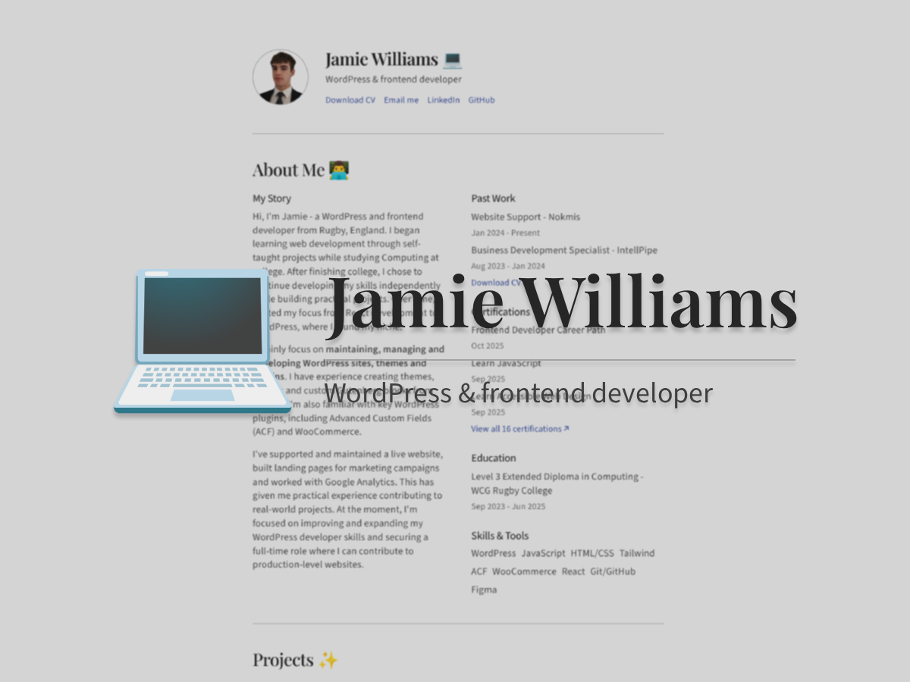
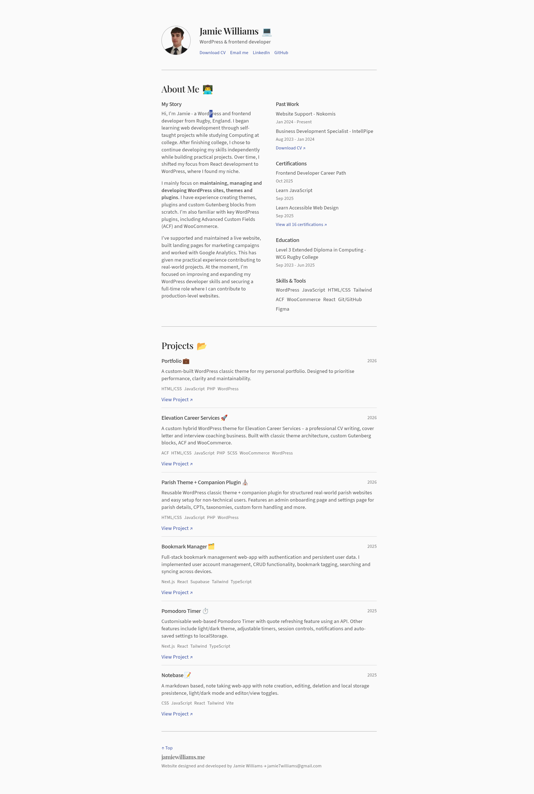
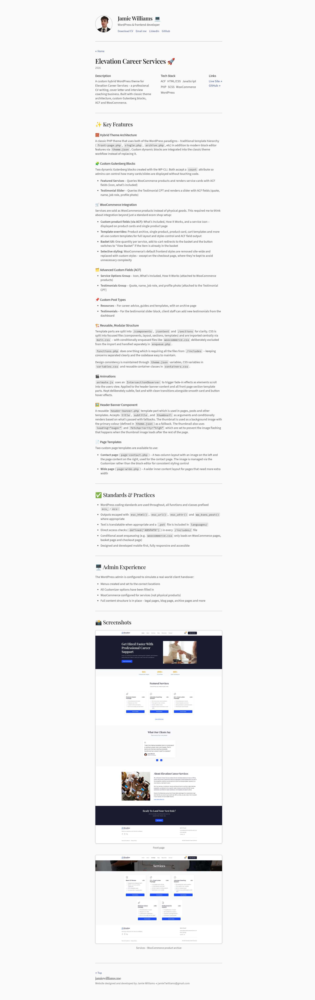

# 💼 Portfolio

A custom-built WordPress classic theme for my personal portfolio. Designed to prioritise performance, clarity and maintainability.

👉 **Visit live site:** [jamiewilliams.me ↗](https://jamiewilliams.me)



## 📋 Overview

This project is a fully custom WordPress theme which I developed to show my work in a clear, focused and professional way.

Instead of spreading the content across multiple pages, I made the decision to centre the site around a single, structured front page which is supported by individual project pages. The goal was to reduce friction for potential employers. Key information is immediately accessible without unnecessary effort or navigation.

The theme was designed from scratch in Figma and built using a classic WordPress theme architecture. Throughout the project, I focused not just on creating a visually clean result, but also demonstrating key WordPress development practices.

### 🧰 Tech Stack


## 🚀 Core Features

### 🗂️ Project CPT, Taxonomies & ACF Fields

I created a custom `project` post type which is used for single project posts in `content.php` and project post cards in `front-page.php`. It's registered via ACF and exported to PHP.
- **Technology Taxonomy:** A custom `jpt_technology` taxonomy is attached to project posts, making it simple to display each project's tech stack on the project cards (`card.php`) and single project posts (`content.php`). I get the terms with `get_the_terms()` and loop over them to render each technology name
- **Project Field Group :** I created the project field group with a set of ACF fields, I register them in `acf.php`. They add structured data to each project: a release date, GitHub URL(s), live site URL and a WYSIWYG field for the project's main content. The fields are used across `card.php` and the single post `content.php`

### 🎬 Scroll Animations

Scroll animations are used selectively to fit the site's aesthetic without being distracting. I used `IntersectionObserver` in `animate.js`, with two animation styles:
- **Fade in left/fade out right:** This is applied to the subsections in the right-hand column of the About section
- **Fade in up/fade out down:** This is applied to project cards on the front page and the info subsections in the single project post hero section

Animation classes are defined in `animations.css` and toggled in `animate.js`. I used `@media (prefers-reduced-motion: reduce)` which disables all animations for users who prefer reduced motion, in line with accessibility best practices

### 📈 Performance Optimisations

- **Self-Hosted Fonts:** Fonts are self-hosted instead of being loaded from Google Fonts. This removes a third-party request. Only the weights and styles used on the theme have been downloaded which avoids unnecessary bloat
- **Font Inlining & Preloading:** To prevent font flickering on load, all the fonts are inlined and the important fonts are preloaded
- **Conditional Enqueuing:**: Styles and scripts are only loaded where needed. For example, certain stylesheets are enqueued conditionally based on the current PHP template and the mono font is only inlined on singular project posts (where it's only used)
- **Dequeuing Gutenberg Styles:** WordPress ships block editor styles that I didn't need since I developed a classic theme. Therefore, I dequeued them to reduce unnecessary bloat
- **Enqueued Stylesheets > `@import`:** Instead of importing all styles into `main.css` with `@import` (which has known performance issues), I enqueued each stylesheet in `enqueue.php`
- **Image Optimisation:** I converted PNGs to WebPs, this reduces file sizes. Post thumbnails use `loading="eager"`, `fetchpriority="high"` and `decoding="sync"` to prioritise loading since it's above the fold

#### 📋 Lighthouse Summary


#### 📊 Core Web Vitals


## ⚠️ Challenges

### 🔤 Font Flickering
The issue I had was a noticeable flickering during page load/reload. The solution to this was to self-host, inline and preload fonts. Instead of relying on externally hosting Google fonts, I moved to a self-hosted setup. The important fonts that are above the fold on the front page are preloaded.

### 👤 About Section Data
The about section has 5 subsections, some having text, links, dates and titles, not just a simple text field. The WordPress Customizer would have been unnecessarily complex and the ACF repeater field is only available with the paid version. Therefore, I created `about-data.php` in `/includes`, which returns a structured PHP array of the about section content.

I created a helper function in `helpers.php` which gets the about section data using the `static` keyword, so the data is only included once per request regardless of how many times the function is called:
```php
function jpt_get_about_data( $key ) {
    static $data = null;

    if ( null === $data ) {
        $data = include get_template_directory() . '/includes/about-data.php';
    }

    return $data[ $key ] ?? null;
}
```

This keeps the data easy to update. If I wanted to add a new skill or certification, I can just add a value to the array.

### 🖼️ Image Performance & Flickering

Project post thumbnails flickered on page load/reload, this was an issue because they're above the fold. I had to make sure the browser was prioritising them by using `loading="eager"`, `"fetchpriority="high"` and `decoding="sync"` on the thumbnail. The images used across the site have been converted from PNG to WebP, this reduced the file sizes.

### ⚙️ Maintainability & Reusability

The theme is structured in a maintainable way to remain easy to work with during development. `functions.php` uses `require_once` for each `/includes` file, instead of `functions.php` becoming one giant file. I've added reusable helper functions and template parts to avoid repetition. For example, I have `card.php` and `thumbnail.php` template parts which are reused when needed.

The CSS is also structured. The `/css/base` folder has the styles that are used across the theme. It contains: `global.css`, `typography.css`, `variables.css` and `animations.css`. By keeping these separate from page-specific styles makes it easy to maintain consistency. For example, I created a reusable `.jpt-subtext` class defined in `typography.css` and it's used wherever that text style is needed.

### 🧩 Avoiding Unnecessary Complexity

Since this is a theme for my personal portfolio site and not a client project, I intentionally left out some WordPress features to avoid overengineering and unnecessary bloat. Internationalisation, Customizer and block theme features were left out. There would be no real benefit integrating these. I prioritised a clean codebase focused only on what the site required.

## 📸 Screenshots

### 🏠 Front Page



### 🎥 Front Page GIF


### 📰 Single Project Post
